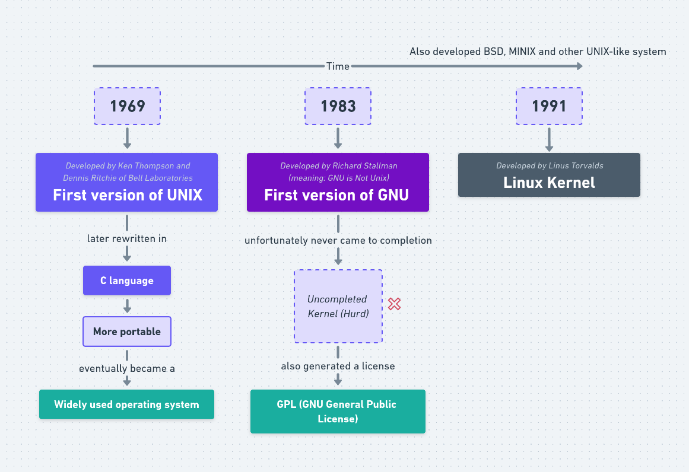

# Kernel History

## Choosing a Linux Distribution

## Debian

> Debian may not get the latest updates, but it's extremely stable. If you want a good "core" operating system, this is the one for you.

> Debian is an overall great operating system for any platform.

## Red Hat Enterprise Linux

Commonly referred to as RHEL.

> As described by the name it's mostly used in enterprise, so if you need a solid server OS this would be a good one.

## Ubuntu

> Ubuntu is a great choice for a beginner who wants to get into Linux. Ubuntu offers ease of use and a great user interface experience that has led to its wide adoption. It’s widely used and supported and is most like other operating systems like OSX and Windows in terms of usability.

## Fedora

> Fedora is great if you want a Red Hat based operating system without the price tag. Recommended for desktop and laptop.

## Linux Mint

> Great user interface, great for beginners and less bloated than Ubuntu. In this course, I’ll be using Linux Mint, but any other distribution can be used

## Gentoo

> If you’re just getting started with Linux and want to take a more difficult path, I’d choose Gentoo or Arch Linux as your distribution.

## Arch Linux

> If you want a lightweight operating system and really want to understand Linux use Arch! There’s a bit of a learning curve, but for the hardcore Linux users, this is a great choice.

> Great for desktop and laptop. If you also have a small device such as a Raspberry Pi and need to stick a lightweight OS on it, you can’t go wrong with Arch.

## openSUSE

> openSUSE is a great choice for a new Linux user. It offers an easy to use graphical installer/administration application (YaST) and a tiday base system, easy to tinker with. openSUSE includes everything you need to enjoy the Internet worry free of viruses/spy-ware and to live out your creativity, be it with your photos, videos, music or code.
